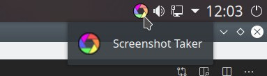

# Screenshot Tray Tool

A basic tool to take screenshots, for Linux and Windows, that lives in the system tray.

## About

Screenshot Tray Tool is a small project I started to learn Electron, Node.js and improve my knowledge of javascript but, hopefully, the end result will also be a basic but useful tool. Once launched it adds an icon to the system tray and you can take screenshots using the "Ctrl + Shift + 3" shortcut (a notification will pop-up if everything went well, and clicking it will open the saved screenshot). More options are available right clicking the icon.

The current version saves the screenshots in the user's Desktop folder.

## Downloads

* [Linux](https://github.com/binarynonsense/screenshot-tray-tool/releases/download/v0.1.0/screenhot-tray-tool-linux_0.1.0.zip)
* [Windows](https://github.com/binarynonsense/screenshot-tray-tool/releases/download/v0.1.0/screenhot-tray-tool-windows_0.1.0.zip)

## TODO (maybe)

* Custom output folder
* Custom shortcut
* Option to start on system startup

## License

BSD 2-Clause [License](./LICENSE)
